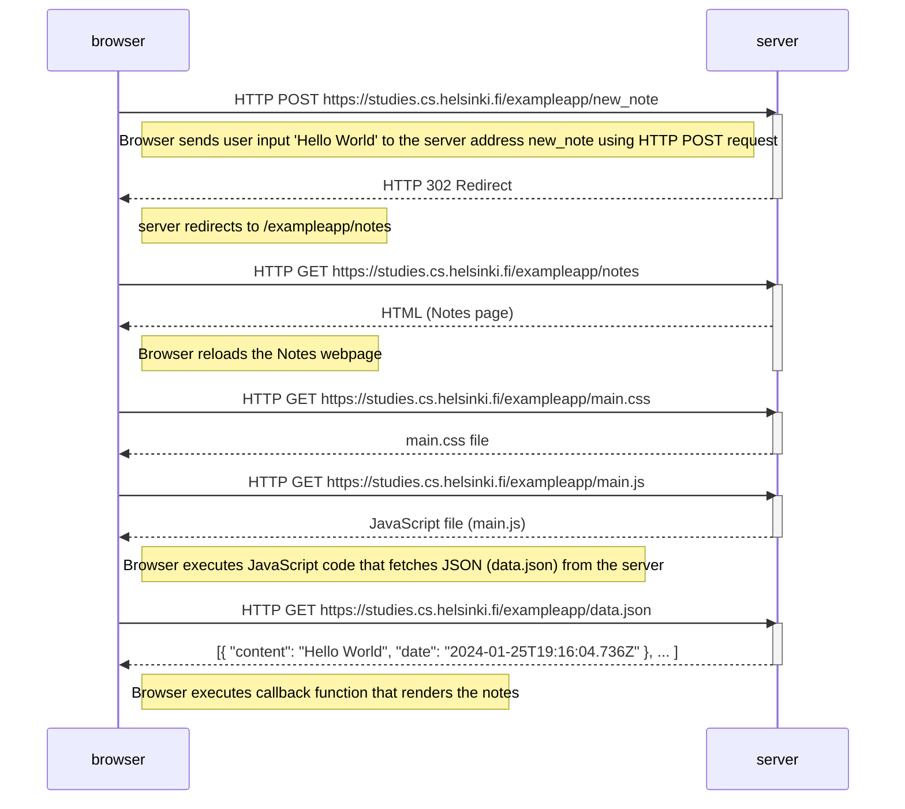

```mermaid
sequenceDiagram
    participant browser
    participant server

    browser->>server: HTTP POST https://studies.cs.helsinki.fi/exampleapp/new_note
    activate server
    Note right of browser: Browser sends user input 'Hello World' to the server address new_note using HTTP POST request
    server-->>browser: HTTP 302 Redirect
    deactivate server
    Note right of browser: server redirects to /exampleapp/notes


    browser->>server: HTTP GET https://studies.cs.helsinki.fi/exampleapp/notes
    activate server
    server-->>browser: HTML (Notes page)
    Note right of browser: Browser reloads the Notes webpage
    deactivate server

    browser->>server: HTTP GET https://studies.cs.helsinki.fi/exampleapp/main.css

    activate server
    server-->>browser: main.css file
    deactivate server

    browser->>server: HTTP GET https://studies.cs.helsinki.fi/exampleapp/main.js
    activate server
    server-->>browser: JavaScript file (main.js)
    deactivate server
    Note right of browser: Browser executes JavaScript code that fetches JSON (data.json) from the server

    browser->>server: HTTP GET https://studies.cs.helsinki.fi/exampleapp/data.json
    activate server
    server-->>browser: [{ "content": "Hello World", "date": "2024-01-25T19:16:04.736Z" }, ... ]
    deactivate server
    Note right of browser: Browser executes callback function that renders the notes

```
