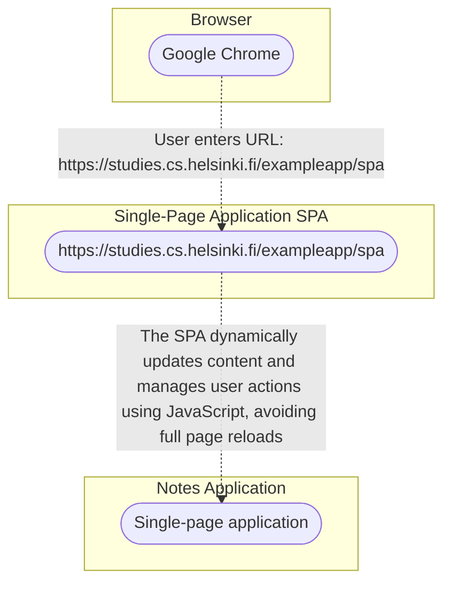

```mermaid
graph TD
    A(round edge) -.->|User enters URL: https://studies.cs.helsinki.fi/exampleapp/spa| B(round edge)
    B(round edge) -.->|The SPA dynamically updates content and manages user actions using JavaScript, avoiding full page reloads| C(round edge)

    subgraph Browser
        A([Google Chrome])
    end

    subgraph Single-Page Application SPA
        B([https://studies.cs.helsinki.fi/exampleapp/spa])
    end

    subgraph Notes Application
        C([Single-page application])
    end
```
