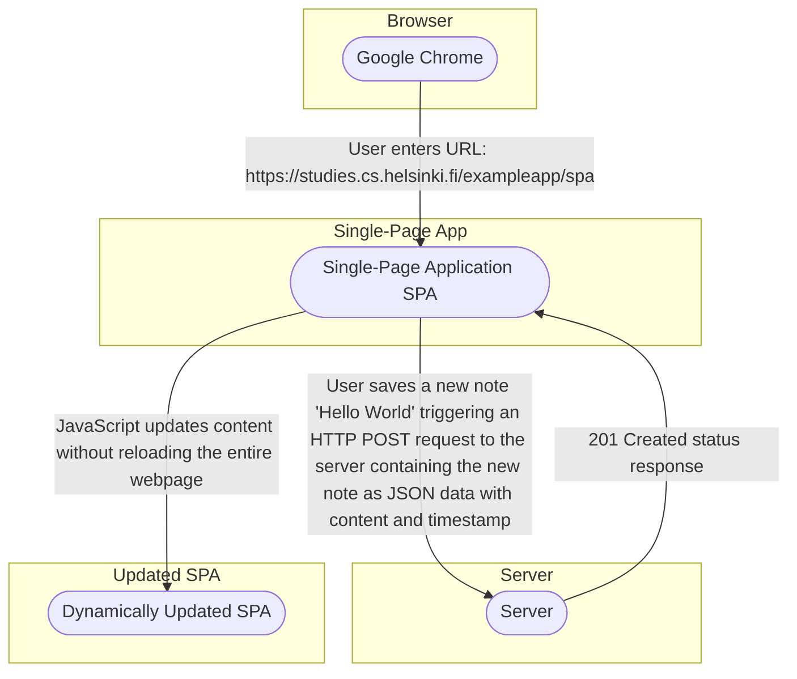

```mermaid
graph TD
    A(User) -->|User enters URL: https://studies.cs.helsinki.fi/exampleapp/spa| B(Single-Page App)
    B -->|User saves a new note 'Hello World' triggering an HTTP POST request to the server containing the new note as JSON data with content and timestamp| C(Server)
    C -->|201 Created status response| B
    B -->|JavaScript updates content without reloading the entire webpage| D(Updated SPA)

    subgraph Browser
        A([Google Chrome])
    end

    subgraph Single-Page App
        B([Single-Page Application SPA])
    end

    subgraph Server
        C([Server])
    end

    subgraph Updated SPA
        D([Dynamically Updated SPA])
    end

```
