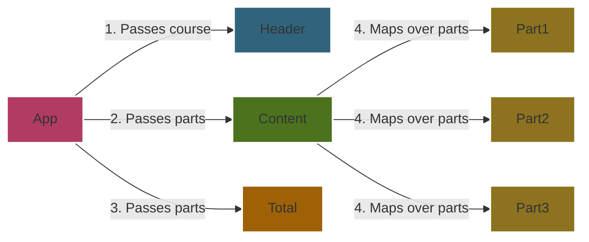

```mermaid
graph LR;
    A[App] -->|1. Passes course| B[Header];
    A -->|2. Passes parts| C[Content];
    A -->|3. Passes parts| D[Total];
    C -->|4. Maps over parts| E[Part1];
    C -->|4. Maps over parts| F[Part2];
    C -->|4. Maps over parts| G[Part3];

    style A fill:#B23B63,stroke:#FFFFFF,stroke-width:2px;
    style B fill:#30647C,stroke:#FFFFFF,stroke-width:2px;
    style C fill:#4B731E,stroke:#FFFFFF,stroke-width:2px;
    style D fill:#9E6106,stroke:#FFFFFF,stroke-width:2px;
    style E fill:#8D731F,stroke:#FFFFFF,stroke-width:2px;
    style F fill:#8D731F,stroke:#FFFFFF,stroke-width:2px;
    style G fill:#8D731F,stroke:#FFFFFF,stroke-width:2px;

```
